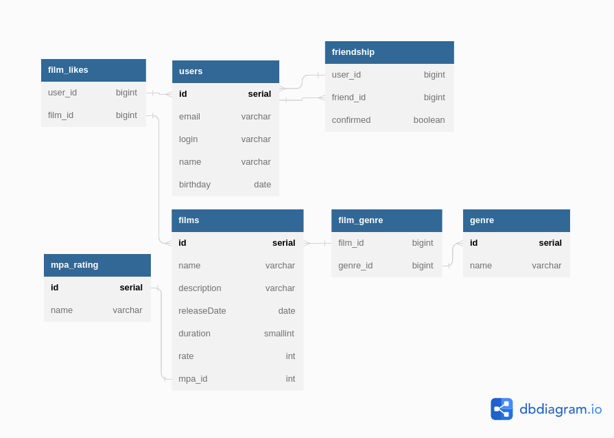

# java-filmorate
Template repository for Filmorate project.

## [Ссылка на диаграму](https://dbdiagram.io/d/64535e91dca9fb07c47bd475)

## Database schema



## Описание схемы
* Таблица User предназначена для хранения информации о пользователях.
Связана с таблицей friendship для хранения информации о друзьях.
Связана с таблицей film_likes для хранения лайков, поставленных пользователем фильмам.

Примеры запросов:

```postgres-psql
update users set email = ?, login = ?, name = ?, birthday = ? 
where id = ?;

select id, email, login, name, birthday from users;

select id, email, login, name, birthday 
from users where id = ?

```

* Таблица film-likes используется для хранения user_id и film_id 
для фильмов, которым пользователь поставил лайк.

Примеры запросов:
```postgres-psql
SELECT * FROM film_likes WHERE user_id = ?;

INSERT INTO film_likes (user_id, film_id) VALUES (?, ?)

DELETE FROM film_likes WHERE user_id = ? AND film_id = ?

```

* Таблица Friendship используется для организации хранения 
информации о друзьях пользователей.

Примеры запросов:
```postgres-psql
SELECT * FROM friendship WHERE user_id = ?

SELECT * FROM friendship WHERE user_id = ? AND friend_id = ?

UPDATE friendship SET confirmed = ? WHERE user_id = ? AND friend_id = ?

DELETE FROM friendship WHERE user_id = ? AND friend_id = ?
```

* Таблица Films используется для хранения информации о фильмах
Имеет связь с таблицами mpa_rating и film_genre.

Примеры запросов:
```postgres-psql
update films set name = ?, description = ?, releaseDate = ?, duration = ?, rate = ?, mpa_id = ? 
where id = ?;

update films set name = ?, description = ?, releaseDate = ?, duration = ?, rate = ?, mpa_id = ? 
where id = ?

select films.id, films.name, films.description, films.releaseDate, films.duration, 
films.rate, mpa_rating.id, mpa_rating.name  from films 
left join mpa_rating on films.mpa_id = mpa_rating.id

select films.id, films.name, films.description, films.releaseDate, films.duration, 
films.rate, mpa_rating.id, mpa_rating.name  from films 
left join mpa_rating on films.mpa_id = mpa_rating.id where films.id = ?
```

* Таблица mpa_rating для хранения возрастного рейтинга фильмов.
Примеры запросов:

```postgres-psql
select * from mpa_rating where id = ?

select * from mpa_rating
```

* Таблица genre для хранения жанров фильмов

Примеры запросов:
```postgres-psql
select * from genres;

select * from genres where id = ?

```

* Таблица film_genre для связи фильмов и жанров

```postgres-psql
INSERT INTO film_genre (film_id, genre_id) VALUES (?, ?)

DELETE FROM film_genre WHERE film_id = ?

SELECT fg.film_id, fg.genre_id FROM film_genre fg JOIN films f ON f.id = fg.film_id 
WHERE f.id = ?

select film_id, genre_id 
from film_genre where film_id = ? AND genre_id = ?
```

## Database script

```postgres-psql
CREATE TABLE IF NOT EXISTS mpa_rating (
  id SERIAL PRIMARY KEY,
  name VARCHAR(10) NOT NULL
);

CREATE TABLE IF NOT EXISTS films (
--todo change to `id` bigint(20) generated by default as identity primary key NOT NULL
  id serial PRIMARY KEY,
  name varchar(255) not null,
  description varchar(255),
  releaseDate date,
  duration smallint,
  rate INT,
  mpa_id INT,
  FOREIGN KEY (mpa_id) REFERENCES mpa_rating (id) ON DELETE SET NULL
);

CREATE TABLE IF NOT EXISTS genres (
  id serial PRIMARY KEY,
  name varchar(255) not null
);

CREATE TABLE IF NOT EXISTS film_genre (
  film_id bigint not null,
  genre_id bigint not null,
  FOREIGN KEY (film_id) REFERENCES films(id) ON DELETE CASCADE,
  FOREIGN KEY (genre_id) REFERENCES genres(id) ON DELETE CASCADE,
  CONSTRAINT film_genre_pkey PRIMARY KEY (film_id, genre_id)
);

CREATE TABLE IF NOT EXISTS users (
  id serial PRIMARY KEY,
  email varchar(100) UNIQUE NOT NULL,
  login varchar(50) UNIQUE NOT NULL,
  name varchar(100),
  birthday date
);

CREATE TABLE IF NOT EXISTS friendship (
  user_id bigint REFERENCES users(id) ON DELETE CASCADE,
  friend_id bigint REFERENCES users(id) ON DELETE CASCADE,
  confirmed boolean not null default false,
  CONSTRAINT friendship_pkey PRIMARY KEY (user_id, friend_id)
);

CREATE TABLE IF NOT EXISTS film_likes (
  user_id bigint not null,
  film_id bigint not null,
  FOREIGN KEY (user_id) REFERENCES users(id) ON DELETE CASCADE,
  FOREIGN KEY (film_id) REFERENCES films(id) ON DELETE CASCADE,
  CONSTRAINT likes_pkey PRIMARY KEY (user_id, film_id)
);


```
